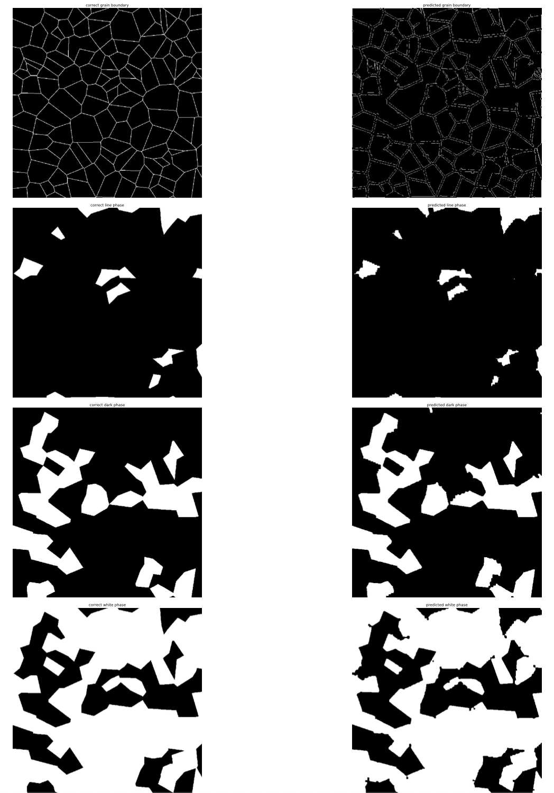
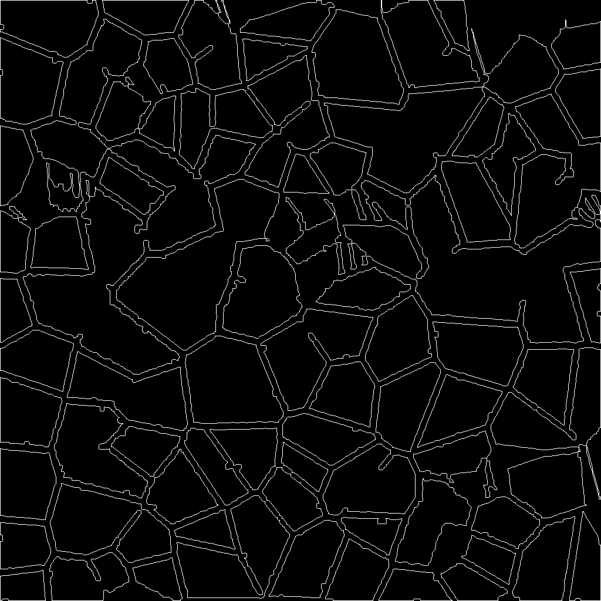
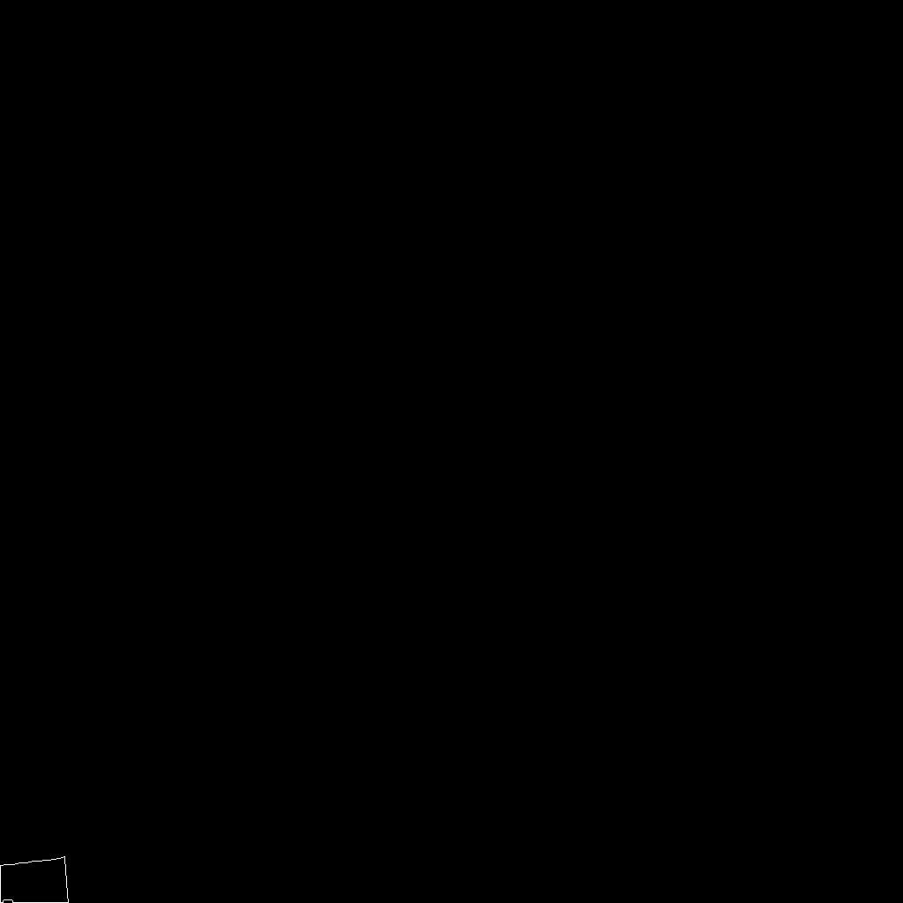
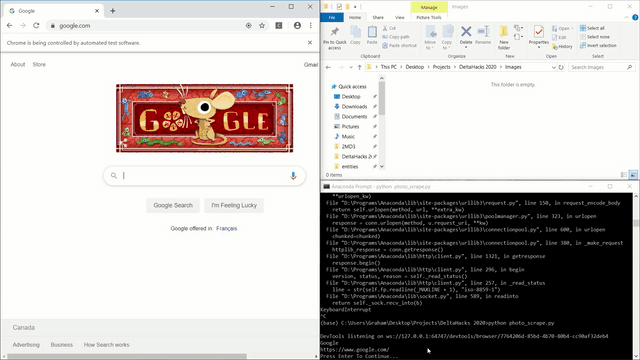
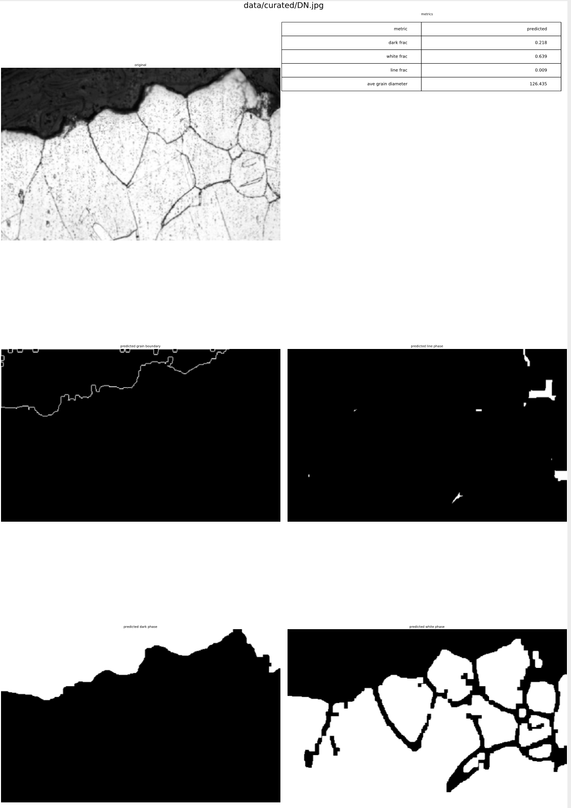

# MicroScan
Created by Maanav Dalal, Jay Mody, Graham Power for Deltahacks 6

A microstructure analysis tool that automatically annotates 2d structures with grain size, distributions, phase masks, and phase fractions using image modeling.

## Usage
```
git clone https://github.com/jaymody/microscan.git
pip install -r requirements.txt
cd flaskapp
python main.py
```
Then, you can open up your browser to the given localhost url, and upload an image (like the one under the sample directory `sample/image_141.png`). Here's a summary of our results (you can find the full list of results in `results.pdf`).

## Masking
Left side is the original, right side is the predicted.


## Grain Boundaries
Orignal

Predicted Grain Outline

Individual Grain Boundaries


## Error
Our algorithms are able to predict phase fractions to an accuracy of 
- `~1% for dark phases`
- `~5% for white phases`
- `~2% for the striped phases`.
(see `results.pdf`)

We also had an error rate of `~5% for grain sizes`.

## Scraped Data
We also wanted to test our image modeling against real data, so we built a web scraper to scrape some online data:


## Real Data Test
Here were the results of the algorithm run on one of the scraped data points (more real results can be found in `results_real.pdf`):

